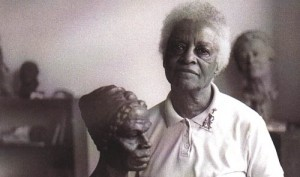

The pilot phase of the Creative Resistance Fund runs from mid-2010 to mid-2011.  During this period, the Fund will make 10-15 small, rapid-response grants to people using creativity to fight injustice.  These grants may be used by the recipient to evacuate a dangerous situation; cover living expenses while weighing long-term options for safety; or act on a strategic opportunity to affect social change.  During the pilot phase, the Fund will be relying on [freeDimensional](http://www.freedimensional.org)'s board of directors for all grant decisions.  Over the past five years, freeDimensional has helped more than 70 culture workers-in-distress through its [Creative Safe Haven service](http://freedimensional.org/services/distress-services/creative-safe-haven/); based on this track record we outlined potential uses of the fund (listed above); however we are also open to tackling new challenges faced by artists doing the work of activists.  During the pilot phase the committee has a mandate to _experiment_ with its grantmaking so that it can revise its funding parameters at the end of the pilot year.  Here's an example of that experimentation:  Back in July, an advisor to the Fund alerted the committee of the impending eviction of 96-year old sculptor, [Inge Hardison](http://www.freemaninstitute.com/inge.htm).  With one look at Hardison's ouevre, using the Fund to lend a helping hand was unquestionable.  Much of Hardison’s work is emotionally involved to her heritage as a woman of African decent. She has created a series of busts of African American heroes that she has called Negro Giants in History.  Hardison is often seen wearing pieces of her work, such as a two-inch pin depicting Sojourner Truth. The original piece was a two-foot work given to Nelson Mandela by (then) New York governor Mario Cuomo in 1990.  In addition to being a sculptor, Hardison is an accomplished photographer too. She was the only woman among the six artists who formed the Black Academy of Arts and Letters.  Hardison once said, “During my long life I have enjoyed using different ways to distill the essences of my experiences so as to share for the good they might do in the lives of others.”  The Creative Resistance Fund chipped in $500 (along with many individual supporters) to build up a bank account from which her future rent payments will come.
