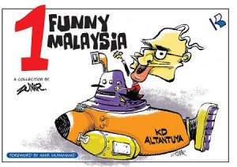

For the last 10 years the government of Malaysia has been seeking to silence one of the more popular political cartoonists in Kuala Lumpur: Zulkiflee Anwar Ulhaque, better known as Zunar. In the past two years he has been arrested and detained, his office has been raided, his cartoons books have been seized, and his publishers and editors have been prevented from publishing his cartoons. Zunar recently took the government to court appealing last year's decision to ban his books. On 14 July 2011, the High Court in Kuala Lumpur decided to uphold last year's banning of his political cartoon books and dismissed his appeal.

"Perak Darul Kartun" and "1 Funny Malaysia", which featured more than 150 individual cartoons, were initially banned by the Malaysian government in June of 2010 under Section 7 of the Printing Presses and Publications Act of 1984. Without elaborating, the judge held, "their contents are not suitable and are detrimental to public order". [Cartoon Rights Network International](http://cartoonistrights.com/) (CRNI) believes nothing could be further from the truth. These two books focus the public's attention on important political and social issues such as conspiracies against the former Deputy Prime Minister Anwar Ibrahim and the murder of Mongolian model Altantuya Shaariibuu and the 'submarine scandal' involving allegations of a kick-back scheme for government's purchase of a submarine that couldn't dive. During a telephone interview with Mr. Zunar, he told CRNI, "Suppression of speech is a much graver threat to public order than one cartoonistís well-informed opinions". Cartoonists Rights Network International deplores the decision of High Court Judge Rohana Yusof who agreed with the governmentís argument that the cartoons would lead to public disorder. As influential as Zunar's work is in shaping Malaysian pubic opinion, there is no evidence that the cartoons would lead to public disorder. In so ruling, the court has furthermore ignored freedom of expression rights as provided by the Malaysian Federal Constitution. CRNI urges the Malaysian government and the Malaysian Court to respect the rights of free speech for all Malaysian citizens and reverse its July 14 decision.

_Cartoonists Rights Network International (CRNI) is a free speech and human rights NGO protecting and monitoring editorial cartoonists around the world who find themselves in trouble because of their influential cartoons._

Dr Robert Russell 20th July 2011
