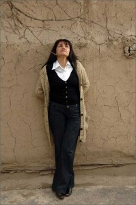

 The Creative Resistance Fund (CRF) is a new initiative started by the [founder of freeDimensional](http://artsrightsjustice.net/profile/ToddLester).  Currently CRF is being incubated and fiscally sponsored by [freeDimensional](http://www.freedimensional.org).  The Fund works in tandem with other services such as [Creative Safe Haven](http://freedimensional.org/services/distress-services/creative-safe-haven/); however, it is intended to become an autonomous fund built on an emerging principle of _network philanthropy_, which has sustained the work of freeDimensional over the past five years.  [freeDimensional is set to expire in 2015](http://freedimensional.org/about/future/) because we feel that ten years is enough to pilot, [document and transfer skills](http://freedimensional.org/wp-content/uploads/2010/10/fD_Final_6Octt.pdf) for the model of critical hosting upon which the initiative was founded in 2005.  We expect that the name freeDimensional will eventually go away, but the practice of Creative Safe Haven will continue to develop and be modified at the intersection of the human rights and artist residency sectors. In its place there will be a new entity called the Creative Resistance Fund; we've started early because we want to pilot, build a track record, collaborate and, ultimately, show how the Fund is essential for supporting an overlooked (and under-supported) demographic of activists.  By 2015 the Creative Resistance Fund will be housed at and receive technical assistance from a pre-existing, reputable foundation.  In the mean time, we will continue to experiment raising resources and re-granting them to people using creativity to fight injustice. In addition to the emergency cash grants we make, we also have an artist residency, travel and living stipend combo that we re-grant in Bilbao, Spain.  Now you might ask: How is this different from freeDimensional programming?  When we conduct a Creative Safe Haven placement at freeDimensional, we have learned about a culture worker-in-distress from a trusted partner (organization or individual); we do research to validate the situation and then present the case to our global network of artist residencies.  We usually narrow down the pool of residencies solicited by geography, proximity, visa eligibility, and _good fit_ in terms of culture and professional needs as well as the level of support a residency can offer at the given time.  This is a service we provide on demand from culture workers.  Here's how the placement in Bilbao is different:  The [Festival Against Censorship](http://freedimensional.org/wp-content/uploads/2010/10/programa-Zentsura-At-3.pdf) is an annual, weeklong event in Bilbao.  As a way to support free expression year-round, the Festival offers a Creative Safe Haven space (with all expense paid) to people using creativity to fight injustice.  This constitutes a demand on the part of the art space and festival.  To date, we have organized residencies for [Druze painter Fahed Halabi](http://artsrightsjustice.net/profile/FahedHalabi), [Uzbek photographer Umida Ahkmedova](http://freedimensional.org/2010/11/men-women-by-umida-akhmedova-screens-in-nyc/), and [Zimbabwe ceramicist Owen Maseko](http://freedimensional.org/2010/11/zimbabwe-artist-maseko-finalist-for-freedom-to-create-prize/) in Bilbao through this partnership with the Creative Resistance Fund.
