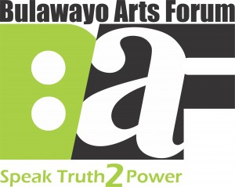

The Khami Prison outside Bulawayo hosted a competitive Arts Festival on 6 July 2010. The participants were drawn from all the prison complex units. The festival was organised by Amakhosi Theatre in collaboration with Khami Prison. Amakhosi has been running workshops with the inmates for the past three years and the project seeks to provide recreation, entertainment and life skills.  A total of 16 groups performed theatre, music, poetry and dance. There was also an exhibition of knitwear and wood craft. The festival had a total audience of 700 inmates of which about 160 performed. William Nyandoro of the Arts Council in Bulawayo and Josh Nyapimbi (BAF) and 2 prison officers adjudicated the performances. Cont Mhlanga of Amakhosi Theatre was the guest speaker.  The theme of the festival was the ‘Zimbabwe’s Indigenisation and Economic Empowerment Act’ (IEEA), which came into force in March 2011. _The IEEA seeks to enforce that local Zimbabweans are entitled to own 51 percent ownership in all foreign-owned companies. Â_ The majority of performances, particularly poetry and music were aesthetically good (presumably due to training by Amakhosi and a huge population of artists at Khami prison), however, the absence of performances that explored and challenged negative implications of the IEEA and the horrendous prison conditions and gross rights violations in prison was discomforting though expected given that there is a censorship office at Khami prison.  The value of the art in prison cannot be overemphasised. However, there is need to promote the status of the artist in prison beyond training. There is an apparent need for advocacy and lobbying on the status of the artist in prison as well.  The lobbying would need to also target UNESCO because the [Recommendation concerning the Status of the Artist](http://www.google.co.zw/url?sa=t&source=web&cd=1&ved=0CBYQFjAA&url=http%3A%2F%2Fportal.unesco.org%2Fen%2Fev.php-URL_ID%3D13138%26URL_DO%3DDO_TOPIC%26URL_SECTION%3D201.html&ei=Aa4WTqyAOoW4hAevrezMBQ&usg=AFQjCNGGu35FF1XHNt8OT9_6GtpXueakcg) does not specifically provide for the artist in prison. The artist in prison has particular needs, which require tailored interventions.

_Reprinted from the [Nhimbe Trust](http://www.nhimbe.org)._
