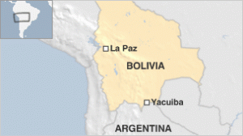

A Bolivian radio journalist has been attacked while he was conducting a radio show in the southern city of Yacuiba.

Staff at Radio Popular said four masked men broke into the studio, poured petrol over presenter Fernando Vidal and set him alight.

 

Mr Vidal, 78, and another staff member are being treated for burns.

Relatives said Mr Vidal had been reporting on smuggling in the border area when the attack happened.

Mr Vidal suffered burns on his face, arms and chest, according to his son-in-law, Esteban Farfan.

A studio technician, Karen Anza, was also injured in the attack.

Some eyewitnesses said the attackers had also thrown Molotov cocktails.

Mr Farfan said his father-in-law had been a harsh critic of the provincial government and had voiced his criticism on air.

He said he believed there were political reasons for the attack, but police have not yet commented on possible motives.

Three people have been arrested on suspicion of taking part in the attack.

Yacuiba is only three kilometres (less than two miles) from the Argentine border.

And while there is a high-volume of cross-border commerce, journalists such as Mr Vidal had been denouncing a rise in smuggling, particularly of liquid petroleum gas.

_Text and photo reposted from Bbc.co.uk._
