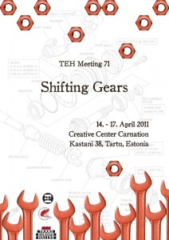

From April 14-17, freeDimensional’s program coordinator Sidd Joag was invited to present [Art Spaces Hosting Activism and Strengthening Community Engagement](http://freedimensional.org/wp-content/uploads/2010/10/fD_Final_6Octt.pdf) at the [Trans Europe Halles Meeting 71](http://www.teh.net/Portals/2/docs/TEH71_programme_www.pdf), titled ‘Shifting Gears’ in Tartu, Estonia.  The meeting brought together representatives from nearly fifty of Europe’s leading independent cultural institutions and was an exciting opportunity for fD to present its [Creative Safe Haven](http://freedimensional.org/services/distress-services/creative-safe-haven/) model to a wider European audience. Special thanks to Lemmitt Kaplinski for joining fD’s workshop and discussing his process and challenges in providing safe haven for [cheap oakley](http://www.oakleyonorder.com/ "cheap oakley") Georgian poet Zurab Rtveliashvili, adding the necessary personalized perspective.  ‘Shifting Gears’ included several performances, short presentations, workshops and discussions investigating the potentials for creative collaboration, artist mobility, resource exchange and capacity building between TEH member organizations.  Congratulations to the [Creative Center Carnation](http://www.nelk.ee/) for hosting an exciting and productive meeting. As Tartu’s first full engagement with the international arts community, Meeting 71 was an important moment in the history of that city’s growing art and culture scene. 

fD is active around the world [cheap oakley sunglasses](http://www.gooakley.com/ "cheap oakley sunglasses") presenting its model of _critical hosting_ as well as being a thought leader on access to artist residencies, emerging trends and diverse models. On Wednesday, May 4th fD will partner with [Residency Unlimited](http://www.residencyunlimited.org) in presenting residency options and general information to members of the [New York Foundation for the Arts'](http://www.nyfa.org)s (NYFA) Immigrant Artist Project at the [Flux Factory](http://www.fluxfactory.org).  Write to us at inquiry@freeDimensional.org if you would like to attend.
