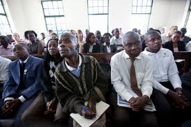
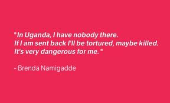

_**On February 18th there are both presidential and parliamentary** [**elections in Uganda**](http://www.ec.or.ug/)**.  If you know of someone who is running for a parliamentary seat, ask them to support the human rights of the LGBT community in Uganda!  If you want to voice your support for Brenda Namigadde not being deported from the UK back to Uganda, get involved with the** [**AllOut campaign**](http://www.allout.org/brenda) **on her behalf!!**_

On January 26th, David Kato, a school teacher and leading gay rights activist whose photo was printed on the front page of a Ugandan newspaper that called for homosexuals to be hanged was bludgeoned to death at his home near Kampala, reports Human Rights Watch and ARTICLE 19. His death came just three weeks after winning a court case against the Ugandan tabloid "Rolling Stone". The Supreme [http://www.raybani.com/](http://www.raybani.com/ "http://www.raybani.com/") Court ruled that "Rolling Stone" violated Kato and others' right to privacy. The victory prevented the paper from repeating stories similar to one in October that had a "Hang Them" headline, alongside pictures, names and residential addresses of members of the gay community.  Read the [full article on IFEX](http://www.ifex.org/uganda/2011/02/02/kato_killed/) and David's [obituary on the BBC](http://www.bbc.co.uk/news/world-africa-12299786). In London, news of David's death [slowed the deportation of Brenda Namigadde](http://www.guardian.co.uk/world/2011/jan/28/uganda-lesbian-deportation-death-gay), an out lesbian who was refused political asylum.  Learn more about the UK's Asylum & Immigration Tribunal [here](http://en.wikipedia.org/wiki/Asylum_and_Immigration_Tribunal).  Quoting Brian Whitaker's article _What in the World?_ in the April 2009 Gay Times:

"According to [Human Rights Watch](http://www.hrw.org), **more than half the countries that still criminalise same-sex acts have these laws because they were once part of the British Empire. The laws were introduced not out of deference to local culture and [Ray Ban outlet](http://www.raybanoutletit.com/ "Ray Ban outlet") customs, but because the imperial rulers wanted to inculcate European morality into the conquered peoples.**"  A conservative evangelical lobby in Washington has enabled an egregious colonial legacy to remain the status quo; see: [Americans’ Role Seen in Uganda Anti-Gay Push](http://www.nytimes.com/2010/01/04/world/africa/04uganda.html).
