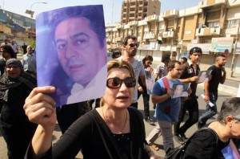

Hadi al-Medhi, one of the main organizers of a mass demonstration on September 9, was found assassinated in his home one day prior. Hadi, an outspoken critic of government corruption and the denial of basic rights, had experienced threats, kidnapping and torture earlier this year. On February 25, after participating in the 'Day of Rage' protests in Tahrir Square in Baghdad, Hadi along with three of his friends were beaten and kidnapped by nearly 15 soldiers. He told Amnesty International that he was taken to a detention center located in a former building of the defense [cheap oakley](http://www.oakleyonorder.com/ "cheap oakley") ministry, where he was beaten, electrocuted and threatened with rape. He was released in the early morning hours of February 26.

freeDimensional joins the international arts and human rights communities to condemn the assassination of Hadi al-Medhi and all attacks on free expression in the Arab world and beyond.

_Image Taken from Al Jazeera online._
