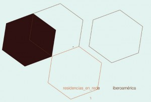

From March 22-27, 2011, freeDimensional director, Todd Lester was invited to present the publication [Art Spaces Hosting Activism & Strengthening Community Engagement](http://freedimensional.org/resources/tactical-notebook/) - a Tactical Notebook made in collaboration with [New Tactics in Human Rights](http://www.newtactics.org) - at two venues in Lima, Peru.  This was the second meeting of [Residencias en Red \[iberoamérica\]](http://residenciasenred.blogspot.com/).  R\_en\_R \[i\] was founded in November 2008 at a meeting organized by the Cultural Center of Spain in Sao Paulo.  The initiative supports the creation of a network intended to strengthen the organizational capacities of residency programs and to generate a space for dialogue between art spaces at the regional level, as well as promoting artist [Gafas Ray Ban outlet](http://www.gafasraybanoutletes.com/ "Gafas Ray Ban outlet") mobility.  There were over 20 artist residency programs in attendance at the _encounter_, which gave freeDimensional a wonderful opportunity to share its model of [Creative Safe Haven](http://freedimensional.org/services/distress-services/creative-safe-haven/) more broadly in the region.

Additionally, fD was invited to make an in depth presentation at [Escuelab](http://escuelab.org/contenido/espacios-de-arte-alojando-activismo), a project of [Alta Tecnología Andina (ATA)](http://www.ata.org.pe/).  fD's model of Creative Safe Haven (and strengthening community engagement through art spaces) will also be presented at meetings of [Trans Europe Halles](http://www.teh.net/TEHMeetings/tabid/175/Default.aspx) (Estonia) and the [Emerging Program Institute](http://www.artistcommunities.org/EPInstitute2011/home.html) of Alliance of Artist Communities (Kansas City) in April 2011.

**Spanish translation:**

LIMA, PERÚ: Presentación de la guía en español para Espacios de alojamiento Artísticos y Fortalecimiento de Activismo comunitario.

Desde el 22 hasta el 27  de marzo del  2011, el director de freeDimensional, Todd Lester fue invitado a presentar la publicación, Espacios de alojamiento Artísticos y Fortalecimiento de Activismo comunitario - un cuaderno táctico realizado en colaboración con Nuevas Tácticas en Derechos Humanos el cual fue presentado en dos locaciones en Lima, Perú. Esta fue la segunda reunión de Residencias de Red \[Iberoamérica\].  R\_en\_R \[i\] la cual fue fundada en noviembre del 2008 en una reunión organizada por el Centro Cultural de España en Sao Paulo. La iniciativa apoya la creación de una red destinada a reforzar las capacidades organizativas de los programas de residencia y de generar un espacio de diálogo entre los espacios de arte a nivel regional, así como de promover la movilidad [http://www.raybanoutletes.com/](http://www.raybanoutletes.com/ "http://www.raybanoutletes.com/") de los artistas. Hubo más de 20 programas de residencias artísticas presentes en el encuentro, lo cual brindó a  freeDimensional una maravillosa oportunidad para promocionar su modelo de Refugio Creativo Seguro, de manera más amplia en la región.

De igual manera, fD ha sido invitado a hacer una presentación más a fondo en Escuelab, un proyecto de Alta Tecnología Andina (ATA).  El modelo de Refugio Creativo Seguro, (y el compromiso de fortalecer la comunidad a través de espacios de arte) también se presentará en las reuniones de Trans Europe Halles (Estonia) y el nuevo programa del Instituto de la Alianza de Comunidades artista (Kansas City) en abril de 2011.
