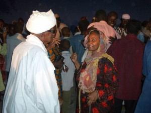

Todd Lester founded freeDimensional in 2006 with Hugo Espinel, a filmmaker, and Alexandra Zobel, a literature professor, both from Colombia.

From 2002-03, Todd managed a project with American University’s Center for Global Peace that strove to organize and facilitate cross-border taskforces for Turkish, Armenian and Azerbaijani NGOs and municipal leaders. In light of the fact that they could never convene all the community leaders in one of their own countries, a colleague, Diana Fakiola had the idea to invite them to her family’s farm on the island of Tzia in Greece. Todd was inspired that all it took was going swimming together and sitting in lawn chairs around a fire to transform decades-old-hostilities into manageable negotiations that could be resolved in a mutually beneficial manner. The idea of ’hosting’ – which is foundational to freeDimensional – started taking shape.

In 2005, while in Sudan working for the International Rescue Committee, Todd met Gadalla Gubara, a blind filmmaker in his 90s, and his daughter, Sara. They invited Todd to come and visit their studio. He learned that in 1998, the Sudanese government issued a decree of eminent domain that allowed it to take the land where Gad’s film studio stood. According to Sara, the day of the decree was the day that Gad went blind. The military used his studio as a dormitory while his equipment and film reels were haphazardly stacked in corners, all stored improperly and some destroyed. While Sara continues to fight for all of the land that was taken from them, a portion of the land including the studio and its courtyard, was returned to the family in early 2005.

Todd had just heard from a friend, Max von Duerckheim, who was forming a theater company in need of practice and performance space. He suggested to Sara that they make a deal with the acting troupe to help clean up Gad's studio in exchange for use of the space. During the course of the project the Vice-President from southern Sudan died in a helicopter crash and Khartoum erupted in violence that mirrored the then-22-year north-south civil divide. They worried that the first public performance they had enjoyed in the backyard of the studio would be the last. But just before Todd's time in Sudan ended in late 2005, there was a second performance in the lot behind the studio where Gad danced in delight with his daughter Sara. (See photo.)

Also while in Khartoum, Todd met a painter named Afifi whose calligraphy shop had been closed by the police because of a political art piece he had installed on an overpass in the city, which decried the poor conditions faced by local artists. Afifi and Gad's stories helped Todd to understand that the authorities in Khartoum were using eminent domain to close spaces of free expression and censor alternative viewpoints expressed through art. The events of 2005 profoundly affected him and he was motivated to put his ideas for freeDimensional into practice. Recognizing that there was a way to help these and other individuals, the freeDimensional concept started to grow with a vision to engage community arts space for free expression.
