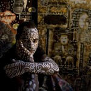

After he fled Cameroon, freeDimensional helped Issa Nyaphaga gain placement in a series of artist residencies while he adjusted to life in exile. Today, Issa runs an indigenous rights organization and continues to produce critical art about critical issues. freeDimensional relies on a global network of art spaces to help its stakeholders access local resources and provide safe haven when they arrive in a new community. This service is called [Creative Safe Haven](http://freedimensional.org/services/distress-services/creative-safe-haven/).

To remain in contact with his homeland, Issa founded Hope International For Tikar People in 2000. HITIP brings together a wide range of global activists who travel to Tikar country in Cameroon every summer to provide direct support to indigenous communities. Since 2009, the partnership between the U.S. charity organization Bush Medicine Partnership (Drexel University) and Hope International For Tikar People, have served more than 8000 people in the isolated communities in the rain forest of Cameroon. In the summer of 2013, with fD's support, Issa travels to Cameroon with a team of volunteers to launch Radio Taboo, a community based radio station focused on broadcasting vital health information to communities at risk.

For more information on Issa's on-going cultural activism, visit:

[http://www.hitip.org/en/](http://www.hitip.org/en/) [http://www.radiotaboo.com/#!the-radio](http://www.radiotaboo.com/#!the-radio)
