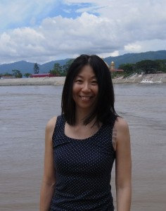
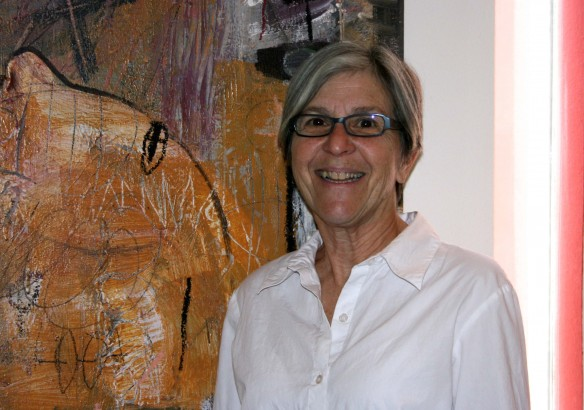
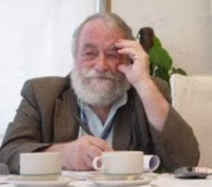
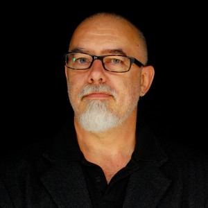
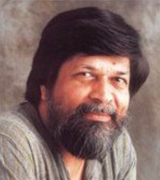
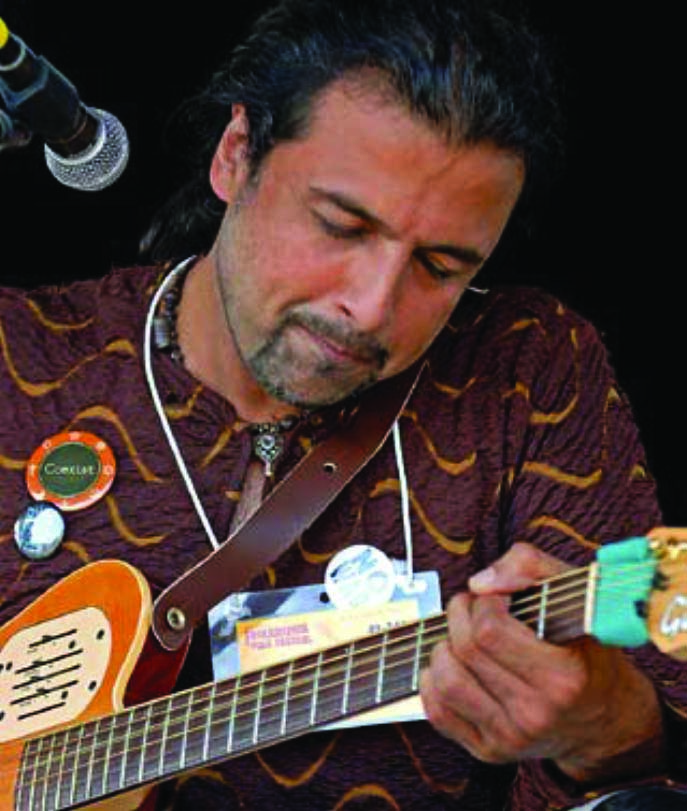

## Team

### Sidd Joag, Program Development Consultant

Sidd comes from backgrounds in the visual arts and social sciences, having spent several years prior to joining fD, working with community arts projects in New York, India, China and co-founding an artist residency/exchange program in Southwestern China, focused on ethnic minority cultural preservation in the China-Burma borderlands. Sidd has an MSc in Sociology from the London School of Economics and Political Science with concentrations in Crime, Control and Globalisation, Cultural Theory and New Media and a B.A. in Sociology from New York University. His paintings, installations and experimental films have been seen in the United States, Canada, India, the Philippines, China and Northern Ireland. He is a co-founder of Zero Capital Arts, which supports low-cost socially and politically engaged creative projects and exhibitions.

### Ruben Mercado, Designer

Rubén D. Mercado is an art director, graphic designer and musician based in  New York City. Born and raised in El Barrio section of New York, the salsa music, murals and graffiti of his neighborhood became the inspiration for a career in the arts. He brings over 20 years design experience to freeDimensional. In that time he has had the honor of working with institutions such as, Friends of the World Food Program, Orbis, United Nations, East Harlem Tutorial Program, and New York Theatre Workshop.

### June Yap, Southeast Asia Adviser

June Yap is an independent curator, previously Deputy Director and Curator of the Institute of Contemporary Arts Singapore, and curator at the Singapore Art Museum. Selected curatorial projects include _No Country: Contemporary Art for South and Southeast Asia_ as part of the Guggenheim UBS MAP Global Art Initiative, _The Cloud of Unknowing_ at the 54th Venice Biennale with artist Ho Tzu Nyen (Italy), the video programme _You and I, We’ve Never Been So Far Apart: Works from Asia_ for VideoZone5 for the Center for Contemporary Art in Tel Aviv (Israel), _The Future of Exhibition: It Feels Like I’ve Been Here Before_ at the Institute of Contemporary Arts (Singapore), _Das Paradies ist Anderswo / Paradise is Elsewhere_ at Institut für Auslandsbeziehungen (ifa)(Germany), and _Bound for Glory_ with artist Wong Hoy Cheong at the National University of Singapore (NUS) Museum.

### Adham Bakry, Cairo Correspondent

Adham is a graphic designer and photographer, and has a BA in architecture. He recently had an exhibition of his photography entitled ‘ Maat el Kalam’ at the Townhouse Gallery of Contemporary Art in Cairo. Adham is always looking for new challenges – artistic and otherwise – for example, [he enjoys riding his bike around Cairo!](http://www.youtube.com/watch?v=iKC0J4ro4Eg&feature=player_embedded#at=13)

 

### Arthur Bouie, Special Projects Consultant

Arthur joined freeDimensional in 2005 as Special Project Manager to help create their human resources solution for the New York Office and help start the Artist-in-Community program. Previously, Arthur spent three years at Ad Hoc Art an art gallery and design studio in Brooklyn, NY as their H.R Manager and Office Director.

 

### Ari & Shira Evergreen, Web & Video Consultants

Shira and Ari Evergreen (a.k.a. Shirari Industries) are queer vegan multimedia artists and community organizers living and working in Ithaca, NY. They make movies and illustrations, take photos, make music, write articles and fiction, organize and promote events, teach and facilitate, and design websites and print materials for individuals and groups in Ithaca and around the world who share their vision of social and environmental justice, including nonprofits, activist groups, artists, and filmmakers. [shirari.com](http://shirari.com/)

## Board of Directors

### Todd Lester, Founder

Todd recently assumed the role of Executive Director for Global Arts Corps before which, he consulted for the Los Angeles Department of Cultural Affairs, Fonds BKVB, Lambent Foundation, Arts Collaboratory, and the Astraea Lesbian Justice Foundation.  Currently, he serves on the boards of artist and literary residencies in India, Germany, and Mexico and recently wrote desk studies for FREEMUSE/SIDA and Res Artis/Fonds BKVB on the residency sectors in Afghanistan, Pakistan, Turkey, West Africa, North Africa, Middle East, Central America and South America.  In Winter 2012, Todd convened a workshop for the Heinrich Boell Stiftung on ‘Conditions that put Artists in Danger’ for its February 2012 Radius of Art conference and gave a keynote address to the Tokyo Performing Arts Meeting on residency and new forms of sharing in the wake of Japan’s 2011 earthquake.  Todd holds a Masters of Public Administration from Rutgers University and is a graduate of the Refugee Studies Centre’s Summer School in Forced Migration at Oxford University. Todd received the Peace Corps Fund Award for his work starting freeDimensional; was named ‘Architect of the Future’ by the Waldzell Institute in 2008; and serves as a Senior Fellow at the World Policy Institute where he is the focal point on issues of art and policy.

### Anne Dunning

ARTS Action Research is an arts consulting group widely recognized for its groundbreaking work in redefining the role, relationships, and operation of organizations in today's challenging arts environment. ARTS Action Research specializes in working with performing, visual, literary, presenting and service organizations on individually tailored planning processes and strategies. The Team of Associates at AAR address a range of needs from the most basic developmental to complex restructuring and repositioning of veteran organizations. Principal Associate, Anne Dunning has an ongoing working relationship with freeDimensional, planning and facilitating annual training opportunities and supporting strategic and organizational planning work.  [www.artsaction.com](http://www.artsaction.com/).

### **Hugo Espinel**

Hugo is a Documentary Filmmaker and Editor. Due to his current works-in-progress, he was awarded the Tribeca Film Institute All Access Connect fellowship in 2005 and invited to the NALIP Latino Producers Academy in 2007. He has edited a variety of television programs from Martha Stewart's Every Day Food to the GLAAD Awards, and recently worked for Sesame Workshop, the organization behind Sesame Street, in the Digital Media Department. Hugo is currently embarking upon his doctoral research at Barcelona Autonomous University in its Communications Content in the Digital Age program focusing on how NGOs, aid organizations and governments are contend with privacy issues when using mobile telephony to affect social change. He holds an M.A. in Media Studies from The New School University and BA in History from La Universidad Javeriana, Bogotá, Colombia.

 

### **Alexandra Zobel**

Alexandra is a founding member of freeDimensional and was its Communications Director until 2012 when she took time off to raise her daughter. When not chasing a toddler through parks she works as a grant writer and social media consultant specializing in communications strategies for non-profits. She has been a New York Council for the Humanities Fellow, and was a recipient of the CUNY Graduate Fellowship and John F Bird award for minority media coverage.

 

### Phillip Howze

[")](http://freedimensional.org/about/people/phillip-sm/)Mr. Howze is an emerging dramatist and director. His plays have won the Audience Award at the Edward Albee/Last Frontier Theater Festival, Florida Playwrights Process’ Young Playwright Award and an NAACP Act-So Gold Medal. Mr. Howze also performed on stage with the late August Wilson, under the direction of Peter Dubois. From 2005 to 2007, he worked as an educator and cultural curator for the U.S. Embassy in Burma, and his ongoing theater work with artists in Burma/Myanmar has been profiled in The New Yorker by George Packer and in the Spring 2009 issue of The Drama Review. In March 2011, Mr. Howze traveled to Istanbul and Konya, Turkey to conduct workshops on collaborative performance practice as a cultural specialist for the US Embassy in Ankara. Since 2008, Mr. Howze has been the Program Associate at the Open Society Foundations where he manages grants to cultural agents working in countries across Southeast Asia.

### **Caron** **Atlas**

Caron is a Brooklyn, New York-based consultant working to support and stimulate arts and culture as an integral part of social change. She currently directs the Arts + Democracy Project, Arts & Community Change Initiative, and Place + Displaced, a project of Fractured Atlas. Additionally she consults with foundations, which have included Ford, Nathan Cummings and Surdna, and teaches at New York University and Pratt Institute. Atlas worked previously at Appalshop, the Appalachian media center, and was the founding director of the American Festival Project, a national coalition of activist artists. She has also worked with National Voice; Animating Democracy; the Urban Institute; and Cultural Blueprint for New York City. A frequent writer about arts activism and cultural policy, Atlas is co-editor of Critical Perspectives: Writings on Art and Civic Dialogue. She was a Warren Weaver Fellow at the Rockefeller Foundation and holds a Masters degree from the University of Chicago.

### **Kayhan Irani**

Kayhan is an Emmy award winning writer, a performer and a Theater of the Oppressed trainer. She directs participatory arts projects with government agencies, community based organizations, international NGOs and with the general public.  She has also led theater for change projects in conflict zones such as Afghanistan (2010) and Iraq (2004).  She is a senior trainer at the Theater of the Oppressed Laboratory N.Y.; the oldest Theater of the Oppressed training center in the US. Kayhan’s work has been supported by the BBC World Service Trust, The Environmental Protection Agency, Bronx Council for the Arts, the New York Foundation for the Arts, and the American Society for Muslim Advancement.  Her work has been written about in such publications as The New York Times, Colorlines Magazine and The Washington Report on Middle East Affairs.  Her published work includes _Telling Stories to Change the World: Global Voices on the Power of Narrative to Build Community and Make Social Justice Claims_” (Routledge, 2008).  Kayhan is a member of the Dramatists’ Guild.

### Diane R. Karp

Diane is an arts activist, arts educator, arts connector and devoted supporter of the creative process in all realms of society. She has a Ph.D. in Art History and after teaching 20th-century art history at Temple University she became the curator of the "Ars Medica" collection of the Philadelphia Museum of Art where she was responsible for acquiring, researching, and developing “Art, Medicine and the Human Condition,” an exhibition that traveled to 20 countries after opening at the PMA. She collaborated with Dan Fox on “In Time of Plague”, an exhibition at the American Museum of Natural History in New York. Diane moved to New York to become the director of New Observations Magazine, an artist-based contemporary arts journal dedicated to presenting a diversity of editorial voices and images to represent the diversity of the arts community. In September 2001 she moved to Santa Fe, NM, to become the director of the Santa Fe Art Institute where she continues her work with art and community building.

## Distress Services Committee

### Marie Korpe, **FREEMUSE, Executive Director**

Organizer of the 1st World Conference on Music and Censorship and former reporter to the Swedish Broadcasting. Marie is also Co-editor of 'Smashed Hits – The Book of Banned Music', Index on Censorship 6/98. Editor of "Shoot the Singer! Music Censorship Today" published 2004. [www.freemuse.org](http://www.freemuse.org/)

 

### John A. Lent, Ph. D., International Journal of Comic Art

A pioneer in the study of international Third World mass media and comic art, John has authored and edited 71 books and monographs and hundreds of articles.  He was the founding Managing Editor of WittyWorld, is the founding Chair of the Asian Popular Culture Group of the Popular Culture Association and Comic Art Working Group International Association for Media and Communication Research (IAMCR), as well as the founder, publisher, and editor of the International Journal of Comic Art.  John has been a professor since 1960 in Canada, China, Malaysia, the Philippines, and U.S.

### Ole Reitov, FREEMUSE, Program Manager

Co-editor of 'Smashed Hits – the Book of Banned Music'. Took the initiative to the 1st World Conference on Music and Censorship. Has lectured world-wide on music censorship, cultural policies and cultural diversity. Has worked as media and music consultant in Mali, India, Gabon, Botswana and Bhutan and as journalist in more than 40 countries for the Danish Broadcasting Corporation. Former chairman of the EBU World Music Workshop. Former advisor to Danish Center for Culture and Development. [www.freemuse.org](http://www.freemuse.org/)

 

### **Fay Chiang**

Fay  has been a poet, visual artist, community and  cultural activist in NYC Chinatown and the Lower East Side for the past 40 years. At the Basement Workshop (the first Asian American nonprofit  multidisciplinary cultural organization in NYC and the east coast) she  began as a volunteer for the Yellow Pearl project and Bridge Magazine and moved on to coordinate and develop Amerasia Creative Arts in 1973 and became its executive director from 1974 to 1986. Director of Henry  Street Settlement’s Asian American Outreach Program; project manager/special sections editor in NY Newsday’s Public Affairs Office, and director of Poets & Writers’ Readings/Workshops state-wide  re-grant program, she joined Project Reach in 2000 and is currently  working in program development, crisis counseling for young people at risk and supporting youth and adults living with HIV/AIDS.

### **Jessica Litwak**

Jessica is a theatre artist (playwright and performer) , a registered drama therapist,  teacher, and activist, is on the steering committee of Theatre Without Borders, and heads up the Arts and Human Rights initiative for TWB, she is a trainer for Acting Together On The World Stage. She teaches courses in NYC and internationally in Theatre for Personal and Social Change, which combine rigorous theatre training with drama therapy and social justice work. She is a co-founder of The Dream Act Union, Artistic Director of the New Generation Theatre Ensemble and The Heat Collective ([www.heatcollective.org](http://www.heatcollective.org/)) Litwak’s work has been published by Applause Books, Smith and Krause, and The New York Times. She is an Equity actress, a director and a playwright. Her many plays include: The Emma Goldman Trilogy: Love Anarchy and Other Affairs, The Snake and The Falcon, and Nobody Is Sleeping as well as the award winning A Pirate’s Lullaby, GRIM, Wider Than The Sky, The Moons Of Jupiter, and War An American Dream. She has a BFA from New York University’s Experimental Theatre Wing and an MFA from Columbia University. She is a PhD candidate at Antioch University in Leadership and Change Through the Arts. She has been on the full-time theatre faculty of San Francisco State University, Los Angeles City College and teaches in the Graduate Expressive Arts Program at Lesley University.

### Roberto Varea

Roberto Gutiérrez Varea began his career in theater in his native Argentina. His research and creative work focuses on live performance as means of resistance and peacebuilding in the context of social conflict and state violence. Varea's stage work in the United States includes directing premieres of works by Migdalia Cruz, Ariel Dorfman, Cherrié Moraga, and José Rivera, among others. He is the founding artistic director of _Soapstone Theatre Company_, a collective of male ex-offenders and women survivors of violent crime, and _El Teatro Jornalero!_, a performance company that brings the voice of Latin American immigrant workers to the stage. Varea is a member of the Steering Committee of Theater Without Borders, is a regular contributor to journals in performance and peacebuilding, and is co-editor and co-author of the two-volume anthology "Acting Together: Performance and the Creative Transformation of Conflict" (New Village Press). Varea is co-director of the Center for Latino Studies in the Americas (CELASA) and a founding faculty of the Department of Performing Arts, and the Performing Arts and Social Justice Major at USF.

## Advocates Committee

### Paul D. Miller a.k.a DJ Spooky

Paul D. Miller aka DJ SPOOKY is a composer, multimedia artist and writer. His written work has appeared in The Village Voice, The Source, Artforum and The Wire amongst other publications. Miller’s work as a media artist has appeared in a wide variety of contexts such as the Whitney Biennial; The Venice Biennial for Architecture (2000); the Ludwig Museum in Cologne, Germany; Kunsthalle, Vienna; The Andy Warhol Museum in Pittsburgh and many other museums and galleries. His work New York Is Now has been exhibited in the Africa Pavilion of the 52 Venice Biennial 2007, and the Miami/Art Basel fair of 2007. Miller’s first collection of essays, entitled Rhythm Science came out on MIT Press 2004. His book Sound Unbound, an anthology of writings on electronic music and digital media was recently released by MIT Press. Miller’s deep interest in reggae and dub has resulted in a series of compilations, remixes and collections of material from the vaults of the legendary Jamaican label, Trojan Records. Other releases include Optometry (2002), a jazz project featuring some of the best players in the downtown NYC jazz scene, and Dubtometry (2003) featuring Lee ‘Scratch’ Perry and Mad Professor. Miller’s latest collaborative release, Drums of Death, features Dave Lombardo of Slayer and Chuck D of Public Enemy among others. He also produced material on Yoko Ono’s recent album Yes, I’m a Witch.

### Mallika Sarabhai

Educated as an economist and a business manager, Mallika Sarabhai is one of India’s best-known Bharata Natyam and Kuchipudi dancers. Mallika is the director of the Darpana Academy of Performing Arts, a centre for the arts where the focus is on the use of arts for social change. In 1982, she founded Darpana for Development to develop performance as a language for change and JANAVAK, the voice of the people, to record and preserve folk and tribal culture. She has taken her work and that of her company Darpana to over 90 countries of the world and to the farthest parts of India.

A multi-talented creative individual, she celebrates positive reaffirmation of images of womanhood. She has used every medium – dance, theatre, television, film, writing and publishing – for her work, winning recognition in India and abroad. In recognition of her efforts to promote social justice through the arts, she was nominated for the Nobel Peace Prize as part of the 1,000 Women for the Nobel Peace Prize campaign. She has received numerous awards including the **_Knight of the Order of Arts & Letters_**  and the **_Chevalier des Palmes Academiques_****_,_** from the Government of France, and several awards from the Government of India.

As dancer, actress, choreographer, writer, social entrepreneur and instigator of community projects, Mallika Sarabhai has fearlessly challenged audiences to sit up and think, and to realign themselves to critical questions of gender bias, communal hatred, the environment, corruption, violence and more.

### Shahidul Alam

Alam founded Drik Picture Library ([www.drik.net](http://www.drik.net/)) in 1989, the Bangladesh Photographic Institute in 1990, Pathshala, the South Asian Institute of Photography ([www.pathshala.net](http://www.pathshala.net/)) in 1998, Meghbarta ([www.meghbarta.org](http://www.meghbarta.org/)), Bangladesh's first webzine in 1999, Chobi Mela ([www.chobimela.org](http://www.chobimela.org/)), the first festival of photography in Asia in 2000 and Bangladesh Human Rights Network ([www.banglarights.net](http://www.banglarights.net/)) in 2001. He is currently involved in setting up a regional centre for investigative journalism and public information access booths in Bangladesh. A prominent social activist Alam is also a promoter of new media and helped introduce email to Bangladesh in 1994. He also setup the first web portal in the country. Alam has lectured and published widely on photography, new media and education, in the USA, Europe, Africa, Asia and Australia and Latin America in prestige locations like the MIT Media Lab in Boston, as well as showing his work in leading galleries such as the Museums of Modern Art in New York, the George Pompidou Centre in Paris and the Museum of Contemporary Arts in Tehran.

### Salman Ahmad

Salman Ahmad is a doctor by training and rock musician by profession. While in medical school he was also a member of Pakistan's first pop band, Vital Signs, whose debut album sold a million copies. He left Vital Signs in 1990 and founded South Asia's biggest rock band, Junoon. Junoon was the subject of a VH-1 documentary, Islamabad: Rock. Junoon has sold over 25 million albums worldwide and has the distinction of being the first ever rock band to be invited to perform at the U.N. General Assembly by UN Secretary General Kofi Annan back in 2001. Salman is a passionate activist in promoting peace in the Asian Sub-Continent. His efforts in bridge-building between India and Pakistan have resulted in a song/video he produced called Ghoom Tana, which is featured on his latest solo album INFINITI and is currently being broadcast on MTV Desi in the US. [www.junoon.com](http://www.junoon.com/)

### Kay Barrett

A CAMPUS PRIDE 2009 Hot List artist, Kay Ulanday Barrett is a poet, performer, educator, and martial artist navigating life as a pilipin@ transgender/queer in the U.S. with struggle, resistance, and laughter. Based in NY/NJ, their work has featured on stages nationally and internationally; from the NJ Performing Arts Center to the Chicago Historical Museum, Brooklyn Museum to Dublin's Lesbian Arts Festival. Kay’s bold work continues to excite and challenge audiences. Previously, Kay has served on the Board of Directors for Beyondmedia Education and as Membership Director of Mango Tribe, the first all Asian & Pacific Islander American (APIA) Women & Genderqueer performance ensemble in the U.S. Honors include: LGBTQ 30 under 30 awards and Finalist for The Gwendolyn Brooks Open-Mic Award. Kay's work has appeared in several anthologies and journals such as: Make/shift magazine, Kicked Out Anthology, Philippine American Psychology, and Asian Americans for Progress. Kay turns art into action as a dedicated activist who serves LGBTQ communities and youth.  [www.kaybarrrett.net](http://www.kaybarrrett.net)

### DW Gibson

DW Gibson currently serves as Executive Director of the Ledig House International Writer’s Colony in Hudson, New York, which is part of the Omi International Arts Center. He is also the co-founder and co-director of Sangam House, a writers’ residency program in India.  His work has appeared in several publications including The New York Observer, BOMB, Oxford Magazine, Tin House, and Orion. He worked in production and writing on documentaries for the A&E Television Network and MSNBC. His credits include “The Hate Network” and “Inside Alcoholics Anonymous.” He earned a MS from the Columbia School of Journalism. DW is a founding member of Mischief + Mayhem.
