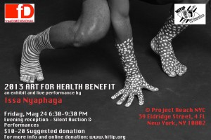

## Save the Date: Friday, May 24 6:30-9:30PM

Join us at [Project Reach](http://www.projectreachnyc.org/) in Chinatown, New York City for an art exhibit, silent auction and performance to fund a mobile clinic this summer in rural villages in Cameroon.

Since 2009, the partnership between the U.S. charity organization Bush Medicine Partnership (Drexel University) and Hope International For Tikar People – a Cameroonian community based organization – have served more than 8000 people in the isolated communities in the rain forest of Cameroon.

Art For Health was launched informally by Issa Nyaphaga 5 years ago. An artist, performer and the founder of HITIP, Issa is himself native Tikar and has been living in exile for more than 15 years. To remain in contact with his homeland, Issa founded Hope International For Tikar People. HITIP brings together a wide range of global activists who travel to Tikar country in Cameroon every summer to provide direct support to indigenous communities.

Watch the video of health care in Tikar villages here: [https://www.youtube.com/watch?v=yUCMKh-GDiA](https://www.youtube.com/watch?v=yUCMKh-GDiA)

Admission by donation (suggested donation $10 – $20) to HITIP

Project Reach NYC : 39 Eldridge Street, 4FL. New York, NY 10002

We look forward to seeing you there!

But, if you don’t make it to NYC you can still make your donation here:

[http://www.hitip.org/en/donate](http://www.hitip.org/en/donate)
