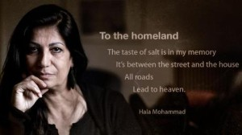

### More literal and visceral, Syrian poetry is being spread on social media and chanted in the streets.

Ghada al-Atrash, a Syrian-Canadian writer and translator, has been studying Syrian poetry for decades.

Yet in all her years of work, she says she has never encountered works of poetry such as the ones emerging today from the depths of a Syria in the throes of an increasingly deadly civil war.

"Today there is literature coming out of Syria that we could have never even dreamed of just a few years ago," Atrash says.

Rather than relying on metaphors and allegorical images, these new poems rely on literal, visceral descriptions, with a newfound emphasis on a united Syrian identity instead of religious symbols. For instance, a poem she translated by Najat Abdul Samad, called "When I am overcome by weakness", reads:

_"I bandage my heart with the determination_ _of that boy /_ _they hit with an electric stick on his only kidney_ _until he urinated blood. /_ _Yet he returned and walked in the next demonstration… /_ _I bandage it with the outcry: 'Death and not humiliation.'"_

Another by Youssef Bou Yihea titled "I am a Syrian", declares: _"My sect is the scent of my homeland,_ _the soil after the rain,_ _and my Syria is my only religion."_

"A lot of poetry and beautiful lyrics are rising up from the ashes in Syria," says expatriate Syrian writer Ghias al-Jundi, who is responsible for PEN International's research on attacks against free expression in the Middle East.

"There is a cultural side to the revolution, and it's brilliant."

**New literary tradition**

It's not just the content that is new. Syrian poetry is also being spread through different channels. Instead of being introduced at formal gatherings or readings, Syrian poets often debut their work at public demonstrations, or on social networking sites such as Facebook.

Mohja Kahf, an award-winning Syrian-American writer and associate professor of comparative literature at the University of Arkansas, wrote an article in 2001 titled "The Silence of Contemporary Syrian Literature", in which she argued that fear, government censorship, and repression were the defining characteristics of Syrian writing.

"That has all changed now," Kahf says, thanks in part to the Internet and social media platforms. "A new Syrian identity and literary tradition are being formed around the events of the last few years."

Poetry is "playing a huge role in Syria right now because the lyrics are part of demonstrations," says Jundi.  "People are singing these verses together in the streets."

Peaceful demonstrations have reduced in number and size as the violence has intensified, but they have not stopped altogether.

Facebook is one of the main channels that Atrash uses to connect with her partners in Syria. She says she discovered two poets from the city of Sweida - Youssef Bou Yihea and Najat Abdul Samad, whose work is quoted above - through the social networking site.

Atrash contacted these writers and was granted permission to translate their works into English.

"I take their poems fresh, translate them, and share them through social media," she says. "It's not just me. Today there are a lot of people translating and spreading Syrian poems from the ground."

Civilians in Syria and around the world are using social networks to share these new poems without censorship. Kahf herself has served as the leader of about 20 Facebook pages focusing on nonviolent components of the revolution.

"The young people in Syria today grew up as part of a global conversation," says Kahf.

Although Atrash believes the revolution is rejuvenating Syrian poetry, both in the Middle East and around the world, she says language barriers between global readers and Syrian writers on the ground keep international audiences from accessing many of these new works.

And it's not just language barriers hindering accessibility. The Internet is not accessible for large swaths of the Syrian population, especially as the UN estimates between a quarter and a third of the country's people have been displaced. Nevertheless, social media tools are among the only platforms for new Syrian writers to connect with each other, whether at home or in exile.

While these past two years have seen a flood of new Syrian writers, not all of Syria's prominent poets participate in this digital sphere.

"People are waiting for opposition poems from Adunis," says Maram al-Masri, a Syrian poet based in Paris, referring to Ali Ahmad Said Esber, one of Syria's greatest living poets.

"He does a little, but for me and for a lot of people, we feel disappointed. It's not enough. We need the fathers of modern Syrian poetry to speak out."

**Dangerous profession**

Yet with the country in the grips of a two-year-long civil war that shows no sign of abating, Syrian poets - and writers more generally - are in more danger today than ever before.

"Poets and writers are disappearing across the country," says Jundi. "Syrian writers are caught between a double danger: the regime and the Islamists. It is a risk to write or utter a word."

Poet Ibrahim Qashoush was kidnapped and killed in July 2011. Two writers - Dia'a al-Abdulla and Tal al-Mallouhi - are still believed to be in prison without access to a lawyer. Writer Khaled Khalifa was attacked in Damascus in May 2012 and his left hand was broken.

"Most of the poets I talk to knew there was a risk of death, imprisonment or exile if you write the truth," says Jundi. "And even if they flee, they can also be killed abroad."

Expatriate Syrian poets have been intimidated: Masri, who recently published a book of poems titled _Freedom, she comes naked_, inspired by social media images and posts from Syria, says she has received death threats and had loved ones in Syria forced into hiding.

"It's not easy to enter a Syrian jail," says Masri. "You don't know if you will ever come out."

Some writers take precautions, saving lyrics under different names in case police search them or their homes, or propagating their poems anonymously. In such an atmosphere, few individual poets of this new style have risen to fame.

But although Syrian writers are still in grave danger, fear no longer controls their work. Violence is so pervasive in Syria that silence is no longer seen as a road to safety.

Before 2011, even the popular tradition of public poetry readings were controlled by government censorship. Now Syrian writers are defying these restrictions. Newly empowered by their passionate audiences, some Syrian poets are holding nothing back.

"We have broken the old phantom of fear," Masri says.

_Text and image reposted from Aljazeera.com_
