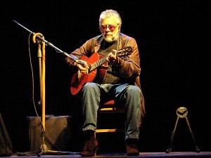

El músico argentino murió en un ataque perpetrado por un grupo armado mientras se trasladaba a bordo de una camioneta por el bulevar Liberación, de la capital del país. 25 impactos de bala recibió su vehículo cuando se dirigía al Aeropuerto La Aurora, luego de una semana de presentaciones  El cantante argentino Facundo Cabral fue asesinado [http://www.gooakley.com/](http://www.gooakley.com/ "http://www.gooakley.com/") en la capital guatemalteca la madrugada de hoy por un grupo armado,  en el momento que se trasladaba al Aeropuerto La Aurora a bordo de una camioneta. 25 impactos de bala recibió su vehículo, que terminó dentro del cuartel de bomberos de la ciudad, donde el piloto trató de refugiarse.   El periodista Erwin Dávila, director de prensa de TGW Radio Nacional de Guatemala, sostuvo en Radio 10 que se trató de un "atentado" y aclaró que "no fue un robo más".  Los hechos ocurrieron sobre las 5:20 horas (local, 11:20 GMT). El  vocero del gobierno, Ronaldo Robles, condenó y lamentó el hecho, y afirmó que las fuerzas de seguridad, por instrucciones del presidente Álvaro Colom, ya iniciaron las investigaciones para esclarecer "lo más inmediatamente posible" lo [cheap oakley](http://www.troakley.com/ "cheap oakley") ocurrido.  Cabral había salido de un hotel donde se hospedaba y se dirigía al aeropuerto para abandonar la ciudad. Estaba acompañado por otra persona que también fue herida de bala, aunque se desconoce su estado de salud.

_Reprinted from [infobae.com](http://www.infobae.com/notas/592436-Asesinaron-al-cantante-Facundo-Cabral-en-un-atentado-en-Guatemala.html)._
