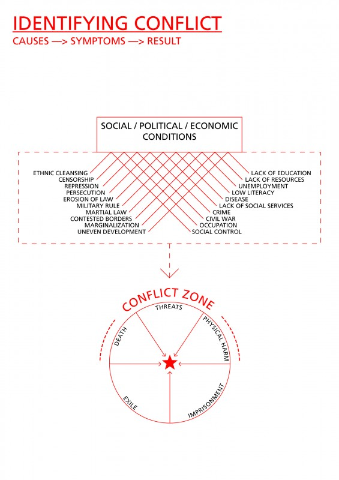

Border Statements is a community arts initiative and artist residency in Ruili City, Yunnan province, on the China-Burma (Myanmar) border, which uses arts and cultural programs to counteract the adverse effects of the Golden Triangle drug trade, human trafficking and HIV/AIDS on ethnic [http://www.raybani.com/](http://www.raybani.com/ "http://www.raybani.com/") minority youth. Launched in 2007 by Zero Capital Arts, the project relies on a network of international and local artists, educators, volunteers, and businesses to provide artists, culture-bearers, community members, students and youth with opportunities to collaborate and develop strategies for cultural preservation.

Zero Capital and freeDimensional are partnering on a Regional Triage Team approach for using the Border Statements network to provide support to culture-workers in distress in Yunnan and the broader region.
