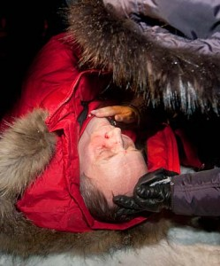

 You have seen a series of events, collaborations and [blog posts](http://freedimensional.org/2010/11/freeing-belarus-through-theatre-world-policy-blog-4/) on Belarus from freeDimensional in the past months.  I might ask, "what good did they do?"  Yesterday - December 19th - witnessed a violent crackdown as thousands of people gathered in the center of Minsk to protest electoral fraud after the [cheap oakley](http://www.troakley.com/ "cheap oakley") polls closed.  This includes the detainment of our colleague [Natalia Koliada](http://www.charter97.org/en/news/2010/12/20/34833/), General Producer of Belarus Free Theatre.  Back in October when Natalia and her husband Nikolai Khalezin were [speaking in New York](http://www.statevoices.org/node/7832), they explained the complications of protest in Minsk: that for every person brave enough to march on the square, there would be an equal number of armed police ... making Belarus a veritable police state.   [This morning on National Public Radio](http://www.npr.org/blogs/thetwo-way/2010/12/20/132198713/hundreds-arrested-in-belarus-protests), I listened to the wife of [Vladimir Neklyayev](http://www.stuff.co.nz/southland-times/news/world-news/4476444/Belarus-election-candidate-beaten) explain how her husband was beaten and then snatched from the hospital by masked thugs.  She still doesn't know where he is and based on her account of events, the hospital where he was kidnapped seemed culpable for the breach of his safety and care .  This sounded all to familiar to the account our friends at [Belarus Free Theatre](http://www.dramaturg.org) gave of a few months ago when a friend and colleague active in the opposition was found hung in his home and the coroner bungled the autopsy report, omitting details that suggested his death was a political [http://www.oakleyonorder.com/](http://www.oakleyonorder.com/ "http://www.oakleyonorder.com/") assassination.  We also just learned that free expression website, [Charter 97](http://www.charter97.org) was [stormed by police overnight](http://charter97.org/en/news/2010/12/20/34841/).  When artists, such as Natalia and Nikolia, are doing the work of activists we must listen to them.  When we have every indicator that the rule of law has broken down and the protective layers of civil society stripped away ... when we know that journalists have become fearful to give literal accounts of the impunity faced by the people they represent, then we also know that artists who bear witness to the societal condition will face danger.  Here is another account of the the election protests and crackdown from [Global Voices](http://globalvoicesonline.org/2010/12/19/belarus-presidential-election-day-ends-in-protests-and-crackdown/), and the World Policy Journal has blogged about the situation [here](http://www.worldpolicy.org/blog/2010/12/20/detained-belarus).
