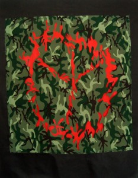

On Friday, September 30, from 4pm to 8pm, performance artist and painter Chaw Ei Thein and radio journalist Lawman Lynch will create "social space" in Creative Time's 'Living as Form' exhibition at the Essex Street Market. \[www.creativetime.org/livingasform\]

Transit Lounge/Waiting Room captures the experiences of fD’s New York stakeholders (artists displaced from their home countries as a result of their artistic activism) through [http://www.gooakley.com/](http://www.gooakley.com/ "http://www.gooakley.com/") performance, visual art, and video interviews. Transit Lounge/Waiting Room will highlight the situation in Burma, in particular the continual attacks on free expression. It explores the experience of displacement and acclimatization to a new environment when an artist is forced to depart their home country.

_Image taken from chaweithein.blogspot.com/_
