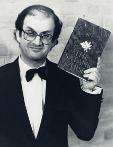

Salman Rushdie has canceled his talk at Jaipur's literary festival after hearing rumors that there were plans to assassinate him.

The controversial author was due to speak about his early work Midnight's Children at India's biggest literary festival, which began on Friday, though influential Muslim [cheap oakley sunglasses](http://www.oakleyonorder.com/ "cheap oakley sunglasses") clerics had protested his participation, [BBC News reported](http://www.bbc.co.uk/news/world-asia-india-16644782).

"I have now been informed by intelligence sources in Maharashtra and Rajasthan that paid assassins from the Mumbai underworld may be on their way to Jaipur to 'eliminate' me," Rushdie said in a statement that was read out at the festival.

The author's controversial 1988 book [The Satanic Verses](http://en.wikipedia.org/wiki/The_Satanic_Verses) is still banned in India, and it incited Iranian leader Ayatollah Ruohollah Khomeini to issue a fatwa calling for his execution, [according to The Guardian](http://www.guardian.co.uk/world/2012/jan/20/salman-rushdie-jaipur-literary-festival?CMP=twt_fd.html). The threat caused the author — who was born in India but has lived in Britain for most of his life — to remain in hiding for many years.

Rushdie has visited India privately several times, and attended the [Jaipur literary festival](http:// http://jaipurliteraturefestival.org/) in 2007.

Author and festival organizer William Dalrymple called Rushdie's decision to stay away from the festival "a great tragedy," BBC reported. Rushdie will speak via video conference [http://www.gooakley.com/](http://www.gooakley.com/ "http://www.gooakley.com/") instead, according to reports.

On Jan. 10, Darul Uloom Deoband, a leading Islamic seminary in India, called on the government to block Rushdie's visa as he "had annoyed the religious sentiments of Muslims in the past," according to the BBC.

The literary festival, in which over 250 authors will be participating, began as scheduled on Friday, according to the BBC. Participants include Michael Ondaatje and Ben Okri, playwright Tom Stoppard, journalists David Remnick and Philip Gourevitch and TV host Oprah Winfrey.

Tens of thousands of people are expected to attend the festival.

The festival's producer, Sanjoy Roy, said there was a [Oakley Sunglasses cheap](http://www.troakley.com/ "Oakley Sunglasses cheap") need in India "to question ... why we continue as a nation to succumb to one pressure or another."

"This is a huge problem for Indian democracy," he told The Guardian.

 

_Text reposted from Globalpost.com. Image taken from Vanityfair.com_
