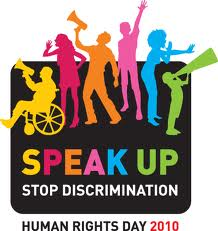

Over this [Human Rights Day](http://www.ohchr.org/EN/NewsEvents/Pages/HRDay2010.aspx) weekend, freeDimensional will be participating in the [International Institute of Humanitarian Law's](http://www.iihl.org) Workshop on the [Protection of Cultural Property in Armed Conflict](http://www.iihl.org/iihl/Documents/Programme%20Cultural%20Property%20Seminar%20\(Draft%20as%20at%2022%20Nov%2010\)_2.pdf).  The debate on how to protect cultural property was amplified after the pillaging of Baghdad's museums following the attack on that city.  freeDimensional enters the discussion with the point of view that some of the same conditions which allowed destruction of cultural property in Baghdad were those that adversely affected (or rendered invisible) the city's artists and culture workers during [Ray Ban outlet](http://www.raybani.com/ "Ray Ban outlet") wartime.  In the words of Mary Ann DeVlieg, Secretary General of the [International Network for Contemporary Performing Arts](http://www.ietm.org), "The arts are about looking, critically reflecting and offering a fresh perspective on society. Everyone has the right to express his or her artistic observations, as well as to have  access to the means of producing and disseminating them.  Yet artists - who also often portray human motivations -  can be particularly vulnerable to repressive groups or regimes afraid of this diversity of opinion.  As we reaffirm our commitment to universal values and a democracy based on respect, we need to support the often silenced voices of artists."  On Human Rights Day 2010, freeDimensional seeks to highlight the role of the artist in protecting human rights, their communities, and the cultural institutions they have built, sustained, depended on and (at times) challenged.
