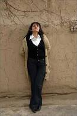

You may remember early this year when an Uzbek court found, Umida Akhmedova, a documentary director guilty of slander for making a film on the difficulties faced by newly married women in the authoritarian [Central Asian state](http://www.guardian.co.uk/world/uzbekistan).  [Umida Akhmedova](http://en.wikipedia.org/wiki/Umida_Akhmedova) was convicted of "offence through mass media" by the court in the capital Tashkent after government experts found her documentary "offensive for the [Ray Ban outlet](http://www.rives.es/es/rayban.php "Ray Ban outlet") Uzbek nation". She could have been sentenced to three years' imprisonment, but was released under an amnesty in honour of the 18th anniversary of Uzbek independence.  Her film Men & Women will be screened during the [New York Eurasian Film Festival](http://www.nyeurasianfilmfestival.com/nyeffofficialselection/officialselection.html).  In the midst of her difficulties with the Uzbek state (and courts), freeDimensional, Producciones Serrano and the Festival Against Censorship worked together to provide her with a two-month Creative Safe Haven residency in Bilbao, Spain.  Read about Umida's ordeal in the Guardian newspaper [here](http://www.guardian.co.uk/film/2010/feb/11/uzbekistan-umida-akhmedova-slander).
