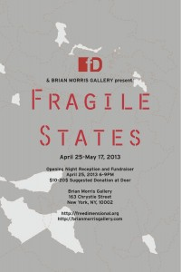

freeDimensional in partnership with the [Brian Morris Gallery](http://brianmorrisgallery.com/) invites you to attend a group exhibition launch and fundraiser, **Fragile States**, on **April 25, from 6-9PM**.

Fragile States is an exploration of the physical and psychological experiences of persecution and forced displacement. The artists featured in the exhibition share a common experience of having to leave their country of origin after facing threats, violent assault, imprisonment or torture as a result of using their creative practice to voice the concerns of their communities.

**Featured Artists: Owen Maseko (Zimbabwe), Zunar (Malaysia), Kianoush Ramezani (Iran), Chaw Ei Thein (Burma), Kardash Onnig (Armenia), Khaled Barakeh (Syria), Arahmaiani Feisal (Indonesia) and Issa Nyaphaga (Cameroon).**

Admission by donation (suggested donation $10 - $20) to freeDimensional. fD supports culture in the service of free expression, justice and equality by protecting critical voices through creative safe haven residency programs, mobilizing critical resources and services and quick-response funding to remove cultural activists from dangerous situations. fD will receive 60% of proceeds from exhibition sales to further regional artist safety initiatives and to support the needs of artists in distress.
