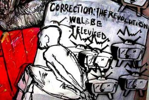

The cast of _Rituals_ a sequel to the play _Heal the Wound_ (2009) which dealt with the wounds of the political violence in Zimbabwe's harmonized general elections of 2008, was arrested in the city of Mutare, Zimbabwe where they are currently touring. In an interview last night, Daves [Ray Ban outlet](http://www.rives.es/es/rayban.php "Ray Ban outlet") Guzha the Producer of the play said that "it is unfortunate that the police arrested the cast when the play was cleared by the censorship board." Guzha and the Lawyers for Human Rights group are working together to facilitate their release.  Due to this incident and [other repressive acts](http://freedimensional.org/2010/11/zimbabwe-artist-maseko-finalist-for-freedom-to-create-prize/), the Zimbabwe Theatre Association (ZiTA), Bulawayo Arts Forum (BAF), Visual Art Association Bulawayo (VAAB), Savanna Arts Trust, Global Arts Trust, the Nhimbe Trust and Homegrown Arts have joined to create a new alliance called the **Coalition against Censorship Zimbabwe** (CACZ).  CACZ seeks to:  Educate and empower art creators, promoters and consumers to defend the freedom to create; Monitor, document and issue Alerts on current censorship issues and violations on free creative expression; Inform and influence judicial opinions, policy and legislation impacting on freedom of creative expression; and Provide educational resources, training and legal aid to individuals and [http://www.jovencitosconcamara.com](http://www.jovencitosconcamara.com "http://www.jovencitosconcamara.com") cultural organizations responding to incidencies of artistic censorship.

_Text for this blog is taken from an email from the Nhimbe Trust, and the image is by Kudzanai Chiurai in an [article on African Colours](http://www.africancolours.com/african-art-features/180/zimbabwe/yellow_lines_from_harare_to_johannesburg.htm)._
