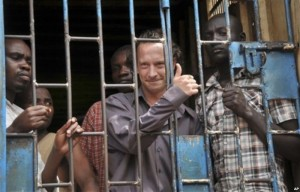

Activists on Friday slammed Uganda for arresting a British theatre producer who staged a play about a gay man in defiance of a ban by the country's media authorities.

Producer David Cecil was charged in court Thursday with two counts including one of “disobeying legal orders” and sent to prison pending a bail hearing next week. He faces up to two years in jail if found guilty, his lawyer said.

“Such acts go against the constitutional provisions of freedom of expression and assembly,” said Clare Byarugaba, a coordinator at gay rights group, the Ugandan Civil Society Coalition on Human Rights and Constitutional Law.

“These charges are ungrounded and only serve to propel further the State of Uganda's anti-gay campaigns,” she said.

Ugandan officials, however, said the arrest was justified and warned that more people involved with the performance could face prosecution if the play is staged again.

“We have already put a directive to police that whoever is taking part in the play and especially those Ugandans who are paid to take part must stop or else they will be inviting the long arm of the law,” said Simon Lokodo, Uganda's ethics and integrity minister.

The groundbreaking play -- titled “The River and The Mountain” -- was performed at several venues around Kampala last month despite an injunction by Uganda's media council, the government media authority, which said it first had to review the script.

The play examines the plight of a man who comes out as homosexual and the motivations of Uganda's vociferous anti-gay lobby.

Written by British playwright Beau Hopkins, it was directed and performed by Ugandans.

Homosexuality is already a crime in Uganda but proposed legislation currently before parliament would see the death penalty introduced for certain homosexual acts.

Although legislators have said the bill could be changed, in its current form, anyone caught engaging in homosexual acts for the second time, or engaging in gay sex where one partner is a minor or has HIV, would be sentenced to death.

Public discussion of homosexuality - including by rights groups - would be punished by up to seven years in jail.

_Text reposted from Iol.co.za. Image reposted from Voanews.com._
