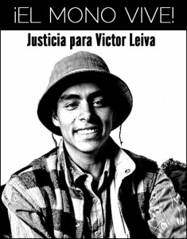

Dear friends,

On the 2nd February 2011 our friend Víctor Leiva, known as “_el Mono”_, left the cultural center where he was taking dance classes. Moments later a firearm cut his life short.

Víctor was 24 years old when he was murdered. He was an [http://www.gooakley.com/](http://www.gooakley.com/ "http://www.gooakley.com/") artist and human rights defender, focusing particularly on the rights of young people, with whom he also worked.

This deplorable act of violence was condemned by civil society and national and international human rights organizations. **A letter sent to Guatemala's Public Prosecutor on the 2nd August 2011, marking six months since his death and requesting the prompt investigation of his murder, was signed by 44 organizations and over 400 individuals from 26 countries.** 

Nevertheless, nearly a year after his murder, the circumstances surrounding his death have yet to be fully investigated. For this reason, **institutional and individual signatures are currently being collected for the attached letter, which will be published in the Guatemalan media on the 2nd February 2012**. It is hoped that even more signatures will be received than in the previous action, to show that the murder of young human rights [cheap oakley](http://www.troakley.com/ "cheap oakley") defenders like Víctor cannot remain in a state of impunity.

You can sign by emailing [quevivavictor@yahoo.com](http://mc/compose?to=quevivavictor@yahoo.com)  or by signing online at[http://www.thepetitionsite.com/2/que-viva-victor/](http://www.thepetitionsite.com/2/que-viva-victor/) **before the 28th January 2012**. (Please indicate your country!)

In solidarity,

Friends of Víctor Leiva

 

_Image taken from http://nisgua.blogspot.com/_
